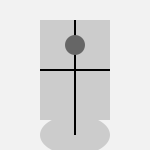

### Robotics Framework - Project Overview

**Developed and Maintained by AI & Robotics Society, MTA**
#### General Purpose Robotics Framework (Codename: RoboCore)

The Robotics Framework project provides a versatile and comprehensive solution applicable to various robotic platforms. It integrates mathematics, physics, and computer science, offering a practical application in live hardware scenarios.

#### Modules:

1. **Visual Detection of Objects Module (Codename: VisionProbe)**
    - **Objective:** Implement visual object detection for robotic platforms.
2. **Detection of Potential Obstacles Module (Codename: ObstacleGuard)**
    - **Objective:** Hybrid approach with additional sensors as sub-modules for obstacle detection.
3. **Inertia State Analysis Module (Codename: InertiaSense)**
    - **Objective:**
        - Stores and analyzes the robot's current inertia state.
        - Assesses position relative to a reference, upright status, and return to the default position.

#### Disciplinary Integration
This project offers a practical application that integrates mathematics, physics, and computer science, providing a holistic learning and application experience.

#### Initial Implementation
The framework can be initially applied to drones or RC cars for performing tricks and self-adjustments.
#### Vision
To create a flexible and adaptable robotics framework with extensive use cases, fostering innovation in the field.

#### Language of Implementation
**Python** will be the primary language used for all Modules in the project.
#### How to Contribute
1. Fork the repository.
2. Create a new branch for your feature: `git checkout -b feature-name`.
3. Make your changes and commit: `git commit -m "Description of your changes."`.
4. Push to your branch: `git push origin feature-name`.
5. Open a pull request and describe your changes.

If your contribution is accepted, you will be added to the contribution list.
#### **Contributors / Credits**

The AI & Robotics Society would like to acknowledge and express gratitude to the following contributors for their valuable contributions to this project:

- Faycal Kilali

## License
This project is licensed under the [GNU General Public License (GPL)](https://github.com/faycalki/robotics-framework/blob/main/LICENSE). See the [LICENSE](https://github.com/faycalki/robotics-framework/blob/main/LICENSE) file for details.

## Disclaimer
This project is provided "as is" without warranty of any kind, express or implied. Use this software at your own risk. The authors and contributors of this project are not responsible for any damages or liabilities associated with the use, modification, or distribution of this software.
